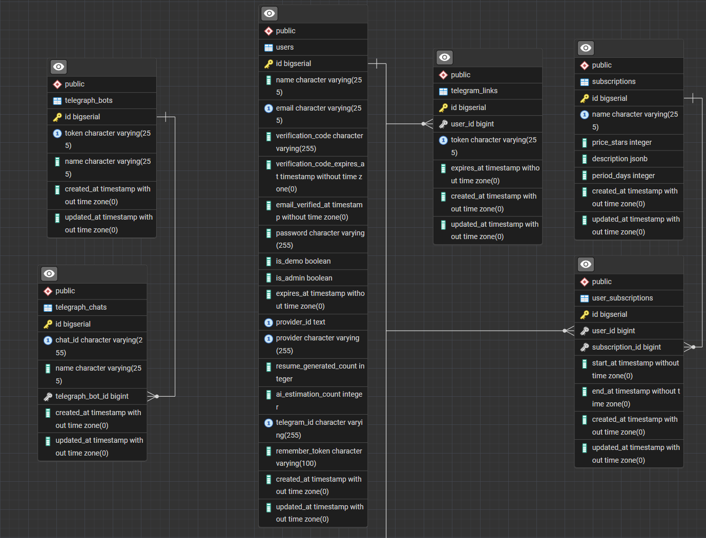
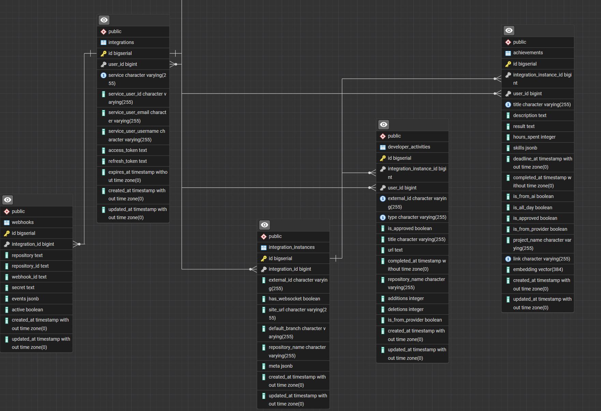

  <h3 align="center">CareerCodex</h3>

  

    The Ultimate AI-Powered Developer Activity Tracker & Portfolio Builder.
     
    <a href="https://careercodex.tech"><strong>Explore the Live Demo »</strong></a>
     
     
    <a href="https://careercodex.tech/login">Sign Up</a>
    ·
    <a href="https://github.com/WinLanEm/careercodex-public/issues">Report Bug</a>
    ·
    <a href="https://github.com/WinLanEm/careercodex-public/issues">Request Feature</a>
  

## 📖 About The Project

**CareerCodex** is a production-grade SaaS platform designed to aggregate, structure, and visualize developer activity from various ecosystems. It solves the problem of fragmented work history by unifying data from **GitHub, GitLab, Bitbucket, Jira, and Asana** into a single, verifiable portfolio.

The platform leverages **AI algorithms** not just to track tasks, but to transform your raw activity logs into professional resume bullet points.

### Key Features
*   **Unified Dashboard:** Aggregate commits, pull requests, and tasks from multiple providers in real-time.
*   **AI Resume Generator:** Automatically analyzes your completed tasks and commits to generate HR-friendly resume points (e.g., *"Optimized database queries reducing load by 30%"*).
*   **Omnichannel Input:** Telegram Bot integration with **Voice-to-Text (Whisper)** for on-the-go task logging.
*   **Smart Webhooks:** Real-time synchronization with external platforms.
*   **Daily Digest:** Automated evening summaries of your productivity delivered via email.

---

## 🏗️ System Architecture

The system is built as a monolithic core with service-oriented components for AI processing, ensuring high availability and scalability.

### Core Schema (User & Billing)
> Handles user authentication (Sanctum), subscription management, and Telegram integration.

### Activity & Integrations Schema
> Manages complex webhook logic and aggregated developer activities.

---

## 🛠️ Tech Stack & Decisions

This project is built with performance and maintainability in mind, strictly following modern Laravel best practices.

*   **Backend:** Laravel 12 (PHP 8.2)
    *   **Architecture:** Heavily relies on **DTOs (Data Transfer Objects)** for strict typing and **Service Layer** for business logic.
    *   **Patterns:** Strategy Pattern for multi-provider integrations, Repository Pattern for data abstraction.
    *   **Modern Features:** Extensive use of **Enums**, **Traits**, **Observers** for model events, and **API Resources** for consistent responses.
    *   **Admin Panel:** Built with **Filament** for managing users and system health.
*   **AI Service:** Python Microservice
    *   Uses **HuggingFace** models and **OpenAI** integration for text generation and analysis.
*   **Database:** PostgreSQL 17 + pgvector
    *   **pgvector** is used for storing embeddings to power semantic search and AI context.
*   **Infrastructure:** Docker Compose
    *   Full containerization including `app`, `worker` (Horizon), `scheduler`, `redis`, `pgsql`, and `reverse-proxy` (Nginx + Certbot).

---

## 🗺️ Roadmap & Status

The project is currently in **Production (v1.0)**.

- [x] **MVP Release:** Core integrations (GitHub, GitLab, Bitbucket, Jira, Asana).
- [x] **AI Resume Builder:** transform tasks into resume achievements.
- [x] **Telegram Bot:** Voice logging and notifications.
- [ ] **Team Mode:** Organization accounts for managing dev teams.
- [ ] **Analytics 2.0:** Velocity charts and Burn-down charts.

---

## 💻 API & Integration

For developers wanting to build on top of CareerCodex, we provide a documented API.
*   **Postman Collection:** [View API Documentation](https://www.postman.com/winlanem/careercodex/collection/uukkhvf/careercodex)

### Scheduled Commands (Scheduler)
The system runs autonomous background processes for data sync and maintenance:
*   `app:sync-services-data-command` (Every 4 hours) - Full synchronization and webhook registration.
*   `app:sync-services-instances-data-command` (Daily 03:00) - Lightweight sync for commits/PRs.
*   `app:delete-expires-demo-users` (Daily 04:00) - Cleanup of demo accounts.
*   `app:database-backup` (Daily 05:00) - Automated backups.
*   `app:send-daily-digest-command` (Daily 18:00) - Sends productivity summary emails.
*   `app:limits-reset` (Monthly) - Resets API usage limits for free tier users.

---

## 🤝 Contributing

While the core codebase is proprietary, we welcome feedback and feature requests!
Please use the [Issues](https://github.com/WinLanEm/careercodex-public/issues) tab to report bugs or suggest new integrations.

---

  Built with ❤️ by <a href="https://github.com/WinLanEm">WinLanEm</a>

